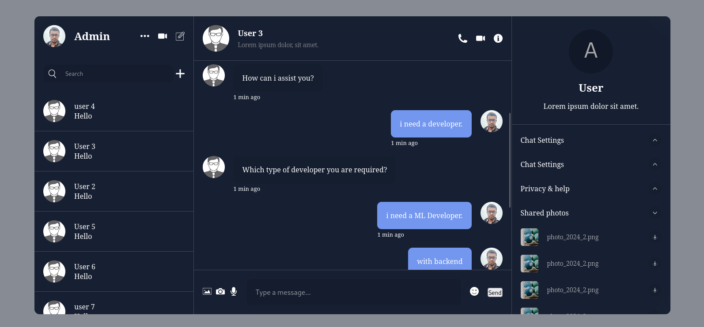
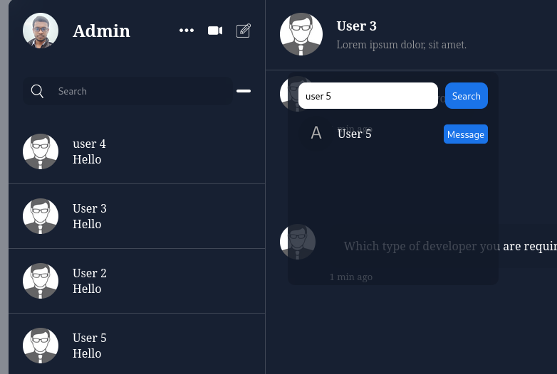
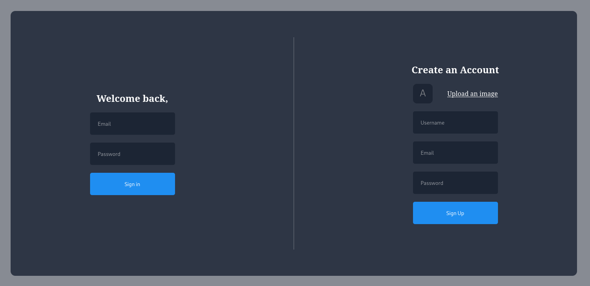

# ChatApp

ChatApp is a real-time communication platform built using Django on the backend and React on the frontend. It allows two friends to chat in real-time, with additional features like friend search functionality. The application leverages Django Channels for real-time communication and WebSocket for seamless data transfer between the server and client.

## Features

- **Real-Time Communication**: Two friends can communicate instantly with each other.
- **Friend Search**: Users can search for friends within the app to start a chat.
- **Django Channels**: Used for handling real-time WebSocket connections.
- **WebSocket**: Facilitates live communication between the client and server.

## Installation

### Backend Setup

1. **Clone the repository**

   ```bash
   git clone https://github.com/Parvez49/chat-app.git
   cd ChatApp/backend
2. Create a virtual environment and activate it
   ```
     python -m venv venv
     source venv/bin/activate
3. Install backend dependencies
   ```
     pip install -r requirements.txt
4. Run database migrations
   ```
     python manage.py migrate
5. Start the Django development server
   ```
     python manage.py runserver

Frontend Setup
1. Navigate to the frontend directory
2. Install frontend dependencies
   ```
     npm install
     npm start





